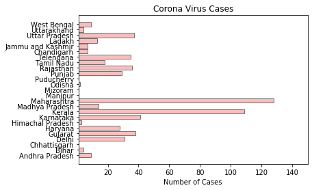

```python
import requests 
from bs4 import BeautifulSoup  
import os 
import numpy as np 
import matplotlib.pyplot as plt
```


```python
extract_contents = lambda row: [x.text.replace('\n', '') for x in row] 
URL = 'https://www.mohfw.gov.in/'
  
SHORT_HEADERS = ['SNo', 'State','Indian-Confirmed', 
                 'Foreign-Confirmed','Cured','Death'] 
  
response = requests.get(URL).content 
soup = BeautifulSoup(response, 'html.parser') 
header = extract_contents(soup.tr.find_all('th')) 
  
stats = [] 
all_rows = soup.find_all('tr') 
  
for row in all_rows: 
    stat = extract_contents(row.find_all('td')) 
    if stat: 
        if len(stat) == 5: 
            # last row 
            stat = ['', *stat] 
            stats.append(stat) 
        elif len(stat) == 6: 
            stats.append(stat) 
  
stats[-1][1] = "Total Cases"
  
stats.remove(stats[-1]) 
```


```python
objects = [] 
for row in stats : 
    objects.append(row[1])  
  
y_pos = np.arange(len(objects)) 
  
performance = [] 
for row in stats : 
    performance.append(int(row[2]) + int(row[3]))
table = stats
def print_table(table):
    longest_cols = [
        (max([len(str(row[i])) for row in table]) + 3)
        for i in range(len(table[0]))
    ]
    row_format = "".join(["{:>" + str(longest_col) + "}" for longest_col in longest_cols])
    for row in table:
        print(row_format.format(*row))
print(SHORT_HEADERS)
print_table(table)
```

    ['SNo', 'State', 'Indian-Confirmed', 'Foreign-Confirmed', 'Cured', 'Death']
        1      Andhra Pradesh     9    0    1   0
        2               Bihar     4    0    0   1
        3        Chhattisgarh     1    0    0   0
        4               Delhi    30    1    6   1
        5             Gujarat    37    1    0   1
        6             Haryana    14   14   11   0
        7    Himachal Pradesh     3    0    0   1
        8           Karnataka    41    0    3   1
        9              Kerala   101    8    4   0
       10      Madhya Pradesh    14    0    0   0
       11         Maharashtra   125    3    1   3
       12             Manipur     1    0    0   0
       13             Mizoram     1    0    0   0
       14              Odisha     2    0    0   0
       15          Puducherry     1    0    0   0
       16              Punjab    29    0    0   1
       17           Rajasthan    34    2    3   0
       18          Tamil Nadu    16    2    1   0
       19           Telengana    25   10    1   0
       20          Chandigarh     7    0    0   0
       21   Jammu and Kashmir     7    0    1   0
       22              Ladakh    13    0    0   0
       23       Uttar Pradesh    36    1   11   0
       24         Uttarakhand     3    1    0   0
       25         West Bengal     9    0    0   1
    


```python
plt.barh(y_pos, performance, align='center', alpha=0.5, 
                 color=(234/256.0, 128/256.0, 252/256.0), 
                 edgecolor=(106/256.0, 27/256.0, 154/256.0)) 
  
plt.yticks(y_pos, objects) 
plt.xlim(1,80) 
plt.xlabel('Number of Cases') 
plt.title('Corona Virus Cases') 
plt.show() 
```





```python

```
